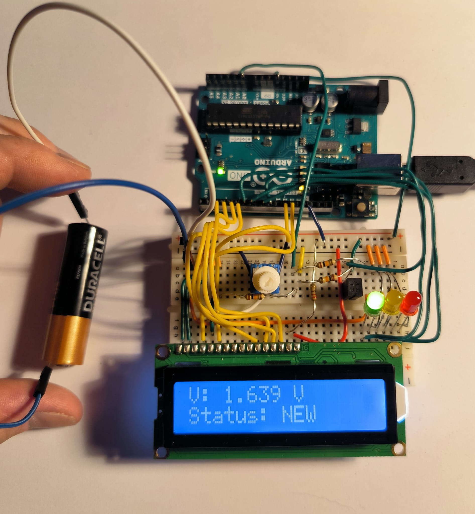
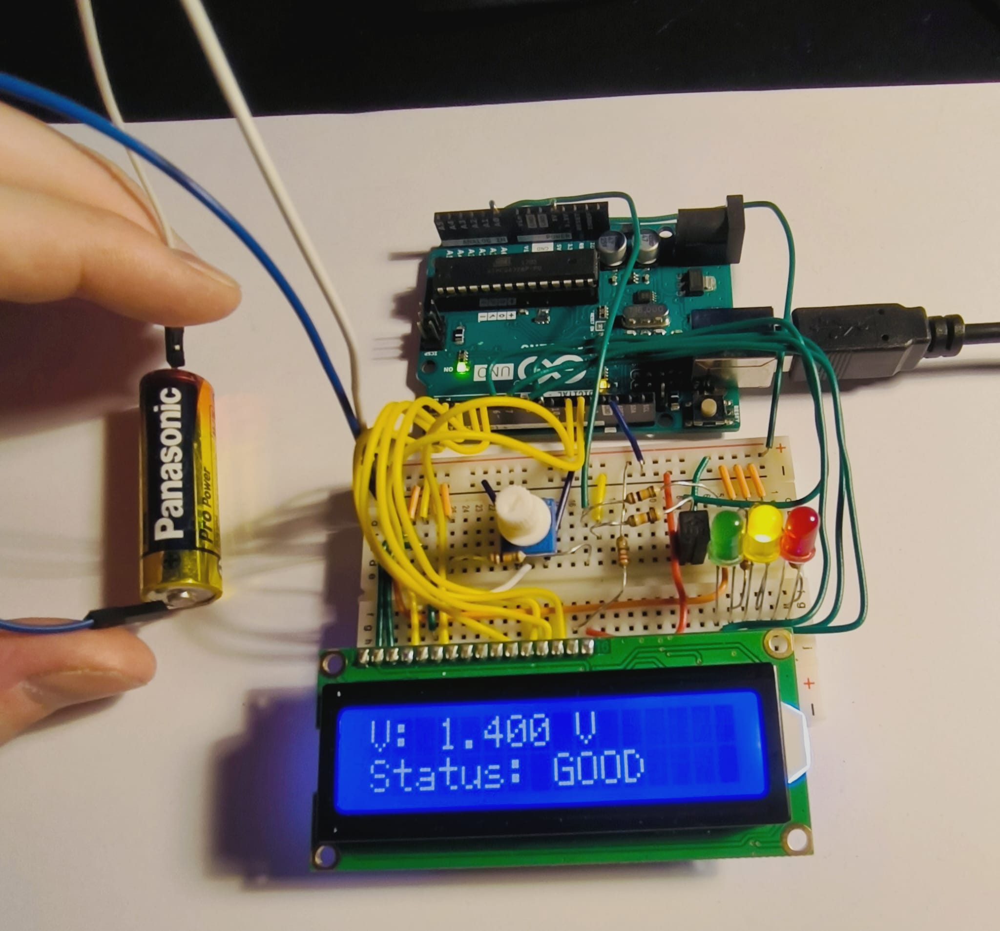
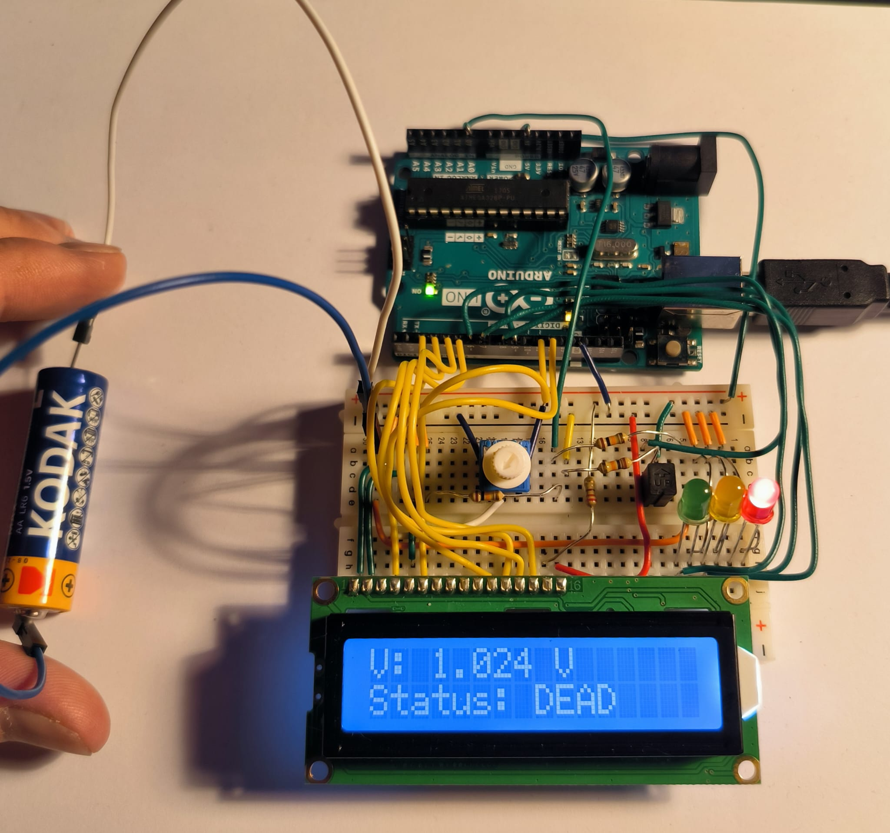

# Arduino Battery Checker (Arduino UNO + 16×2 LCD)

A tiny **battery checker** that measures open-circuit voltage with an Arduino UNO, shows the result on a **16×2 LCD** and over **Serial**, and (optionally) lights a 3‑LED “fuel gauge.”

- Uses the UNO’s **INTERNAL ~1.1 V** ADC reference for high resolution.
- Displays **mV** for very weak cells and **DEAD / LOW / GOOD / NEW** status.
- Includes **presence hysteresis** so the status doesn’t flicker when you touch the cell to the clips.

## Hardware

**From the Arduino Starter Kit:**

- Arduino **UNO**
- **16×2 LCD** (parallel)
- **Breadboard** + jumpers
- Resistors: **10 kΩ ×2** (divider), **220 Ω ×3** (LEDs)
- **10 kΩ potentiometer** (LCD contrast) – or tie VO to GND for max contrast
- LEDs: **red, yellow, green** (optional)

### Wiring

**Battery sense (2:1 divider):**

```
Battery + ─ 10k ──●── 10k ── GND
                  │
                  └── A0 (Arduino)
Battery − ─────────────────── GND
```

**Images:**




**LCD (16‑pin parallel, 4‑bit mode):**

- 1 **VSS** → GND
- 2 **VDD** → 5 V
- 3 **VO**  → middle of 10 k pot; pot ends → 5 V & GND (or VO→GND for max contrast)
- 4 **RS** → D12
- 5 **RW** → GND
- 6 **E**  → D11
- 11 **D4** → D5
- 12 **D5** → D4
- 13 **D6** → D3
- 14 **D7** → D2
- 15 **A (LED+)** → 5 V (add 220 Ω if too bright)
- 16 **K (LED−)** → GND

**LED bar (optional):**

- **D9 → 220 Ω → RED → GND**
- **D8 → 220 Ω → YEL → GND**
- **D7 → 220 Ω → GRN → GND**

> ⚠️ Never connect the battery to the Arduino **5 V** pin.

## Build & Upload

1. Open `arduino-battery-checker/arduino-battery-checker.ino` in the Arduino IDE.
2. Select **Board: Arduino/Genuino UNO** and the correct **Port**.
3. **Upload**. Open **Serial Monitor** @ **115200** baud to see logs.

## Calibrate (optional but recommended)

The UNO’s internal reference varies by board. To tighten absolute accuracy:

1. Measure a test cell with a multimeter → **V_true**.
2. Note the sketch’s reading → **V_disp**.
3. Compute: `NEW_VREF = OLD_VREF * (V_true / V_disp)`
4. Update `VREF_CAL` in code and re-upload.

Resolution is ~**2.1 mV** at the battery per ADC count (with the 2:1 divider).

## Status thresholds

- **NEW**  ≥ **1.50 V**
- **GOOD** ≥ **1.30 V**
- **LOW**  ≥ **1.10 V**
- **DEAD** \< **1.10 V** (LCD also shows mV for values \< 1.000 V)

These are heuristic for **alkaline**. NiMH behaves differently; open‑circuit voltage alone is a rough guide.

## Next steps

- Add a **10 Ω / 2 W** load resistor + MOSFET to test **under load** for a far better state‑of‑charge estimate.
- Add a **buzzer** for DEAD.
- Add a **button** to switch ALK/NiMH modes and adjust thresholds.

---

## License

MIT © 2025 Brian Dooley
